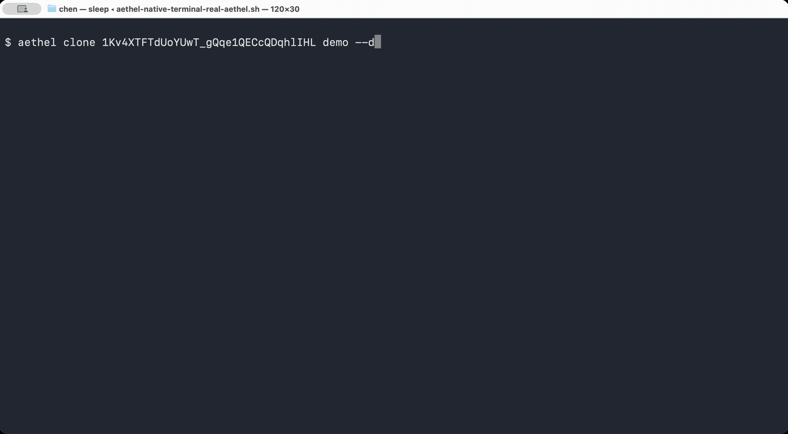

# Aethel

[](https://github.com/CCJ-0617/Aethel/actions/workflows/ci.yml)
[](https://www.npmjs.com/package/aethel)
[](LICENSE)
[](https://nodejs.org)

**Git-style Google Drive sync from your terminal.**

Aethel brings a `snapshot → diff → stage → commit` workflow to Google Drive. Track changes on both sides, resolve conflicts explicitly, and keep a full sync history — all without leaving the command line. It also ships with a dual-pane TUI for hands-on file management.

## Install

```bash
npm install -g aethel
```

<details>
<summary>Install from source</summary>

```bash
git clone https://github.com/CCJ-0617/Aethel.git
cd Aethel
npm install
npm run install:cli   # symlinks `aethel` into ~/.local/bin
npm run install:debug # symlinks `debug_aethel` without replacing `aethel`
```

</details>

**Requires Node.js >= 22.12**

## Setup


### 1. Get Google OAuth Credentials

1. Go to [Google Cloud Console](https://console.cloud.google.com/)
2. Create a project (or select an existing one)
3. Enable the **Google Drive API** (APIs & Services → Library)
4. Go to **APIs & Services → Credentials**
5. Click **Create Credentials → OAuth 2.0 Client ID**
6. Application type: **Desktop application**
7. Download the JSON file

### 2. Save Credentials

Save the downloaded JSON as `~/.config/aethel/credentials.json`:

```bash
mkdir -p ~/.config/aethel
mv ~/Downloads/client_secret_*.json ~/.config/aethel/credentials.json
```

You can also place `credentials.json` in the current directory, or pass a custom path with `--credentials`.

### 3. Authenticate

```bash
aethel auth                    # opens browser, saves token.json
```

### 4. Initialize a Workspace



```bash
aethel clone <folder-id-or-url> ./workspace  # Git-style init + full pull
aethel clone my-drive ./my-drive             # clone entire My Drive

aethel init --local-path ./my-drive     # sync entire My Drive
aethel init --local-path ./workspace --drive-folder <folder-id>  # sync specific folder
aethel pull --all -m "initial pull"     # hydrate local files from the current remote tree
```

> `credentials.json` and `token.json` are local secrets — never commit them.

## Daily Workflow


Aethel is not a background mirror. It uses a Git-like flow:

```text
snapshot -> status/diff -> add/resolve -> commit
```

`status`, `add`, `pull`, and `push` compare three states: the latest Aethel
snapshot, Google Drive, and your local files. A successful `commit`, `pull`, or
`push` saves a new snapshot so the next sync has a clear baseline.

### Review Changes

```bash
aethel status                  # local vs remote changes at a glance
aethel status --short          # compact Git-style status
aethel status --detail         # show every file-level change
aethel diff --side all         # show local and remote changes
aethel diff --side all --detail # include hashes and modified times
```

By default, `status` groups many file-level changes under the nearest changed
parent folder. Use `--detail` when you need to inspect every changed file.

### Sync Both Ways Manually

```bash
aethel add -A                  # stage default suggested actions
aethel diff --staged           # review what will be applied
aethel restore --staged <path> # unstage like git restore --staged
aethel commit -m "sync"        # execute staged operations
```

This is the safest workflow when both Drive and local files may have changed.

### Pull From Drive

```bash
aethel fetch                   # refresh and preview remote changes
aethel pull -m "pull"          # apply remote changes since the last snapshot
aethel pull --all              # download the full remote tree
aethel pull path/to/folder     # pull only matching paths
```

Use `pull --all` for a first full download or when you intentionally want to
rehydrate local files from the current Drive tree.

### Push To Drive

```bash
aethel push -m "push"          # apply local changes to Drive
aethel push path/to/folder     # push only matching paths
aethel push --dry-run          # preview local changes before upload/delete
aethel push --force            # make local state authoritative
```

`push --force` accepts local versions for conflicts and treats Drive-only files
as remote deletions when they do not exist locally. Use `--dry-run` first when
you are cleaning up a large remote tree.

### Resolve Conflicts

When both sides change the same path, Aethel stops and asks you to choose:

```bash
aethel status
aethel resolve --keep local path/to/file    # upload local version
aethel resolve --keep remote path/to/file   # download Drive version
aethel resolve --keep both path/to/file     # keep both copies
aethel commit -m "resolve conflict"
```

Git-style aliases also work:

```bash
aethel resolve --ours path/to/file     # same as --keep local
aethel resolve --theirs path/to/file   # same as --keep remote
aethel resolve --both path/to/file     # same as --keep both
```

### Inspect History And Remote

```bash
aethel remote -v               # show the Drive remote as origin
aethel log --oneline           # compact sync history
aethel show --stat HEAD        # snapshot summary
aethel rev-parse --short HEAD  # resolve snapshot refs
```

### Branches And Tags

Branches and tags are lightweight names for Aethel snapshots. Switching a branch
changes the active snapshot ref; it does not rewrite your working files by
itself.

```bash
aethel branch -v               # show branch refs and Drive target
aethel switch -c experiment    # create and switch branch refs
aethel checkout experiment     # switch to a branch when the name exists
aethel tag v1 HEAD             # name a snapshot for later inspection
aethel restore --source v1 path/to/file
```

## Maintenance Commands

### Verify Integrity

```bash
aethel verify          # check snapshot checksum and local file hashes
aethel verify --remote # also compare Drive file hashes
```

`verify` compares the latest snapshot with the workspace on disk and exits
non-zero when files are missing or modified. Add `--remote` when you also want
to verify Drive state before a migration or restore.

### Clean Ignored Files On Drive

Ignored local files are skipped by normal sync scans. If ignored build artifacts
or cache files already exist on Drive, clean them explicitly:

```bash
aethel clean --ignored
aethel clean --ignored --execute --confirm "DELETE IGNORED GOOGLE DRIVE FILES"
```

The command dry-runs by default and reports the topmost ignored Drive
files/folders it would move to trash. Add `--permanent` only when you really
want Drive items deleted instead of trashed.

### Deduplicate Drive

Multi-device conflicts can leave duplicate folders on Drive:

```bash
aethel dedupe-folders            # dry run — report only
aethel dedupe-folders --execute  # merge duplicates, trash empties
```

Processes deepest-first for single-pass convergence, caches child state to minimize API calls, and runs independent merge groups in parallel.

## Commands

| Command | What it is for |
| --- | --- |
| `auth` | Sign in to Google Drive |
| `clone` | Create a workspace from a Drive folder and download its contents |
| `init` | Connect an existing local directory to My Drive or a Drive folder |
| `status` | Show remote, local, staged, and conflicted changes |
| `diff` | Inspect unstaged or staged changes |
| `add` | Stage suggested sync actions |
| `reset` / `restore --staged` | Unstage changes |
| `commit` | Execute staged sync actions and save a snapshot |
| `fetch` | Refresh remote state without applying it |
| `pull` | Apply Drive changes locally |
| `push` | Apply local changes to Drive |
| `resolve` | Choose local, remote, or both for conflicts |
| `log` / `show` / `rev-parse` | Inspect saved snapshots |
| `branch` / `switch` / `checkout` / `tag` | Name and switch snapshot refs |
| `rm` / `mv` | Git-like local remove and rename helpers |
| `ignore` / `clean --ignored` | Manage ignored paths and remove ignored files from Drive |
| `verify` | Check local and optional remote integrity |
| `dedupe-folders` / `dedupe-files` | Clean up duplicate Drive entries |
| `tui` | Open the interactive terminal UI |

### Git-Compatible Command Forms

Aethel is not Git: `commit` applies Drive sync operations and writes an Aethel
snapshot, while Google Drive is the remote storage. The daily command shape is
intentionally close to Git:

| Git habit                    | Aethel form                                      |
| ---------------------------- | ------------------------------------------------ |
| `git status --short`         | `aethel status --short` or `aethel status -s`    |
| `git diff --staged`          | `aethel diff --staged` or `aethel diff --cached` |
| `git add -A`                 | `aethel add -A`                                  |
| `git reset HEAD <path>`      | `aethel reset HEAD <path>`                       |
| `git restore --staged <path>`| `aethel restore --staged <path>`                 |
| `git commit -m "message"`    | `aethel commit -m "message"`                    |
| `git log --oneline`          | `aethel log --oneline`                           |
| `git show --stat HEAD`       | `aethel show --stat HEAD`                        |
| `git rev-parse HEAD`         | `aethel rev-parse HEAD`                          |
| `git rev-parse --short HEAD` | `aethel rev-parse --short HEAD`                  |
| `git rev-parse --abbrev-ref HEAD` | `aethel rev-parse --abbrev-ref HEAD`       |
| `git branch -v`              | `aethel branch -v`                               |
| `git branch feature HEAD`    | `aethel branch feature HEAD`                     |
| `git switch feature`         | `aethel switch feature`                          |
| `git switch -c feature`      | `aethel switch -c feature`                       |
| `git checkout feature`       | `aethel checkout feature`                        |
| `git checkout -b feature`    | `aethel checkout -b feature`                     |
| `git tag v1 HEAD`            | `aethel tag v1 HEAD`                             |
| `git remote -v`              | `aethel remote -v`                               |
| `git clone <url> <dir>`      | `aethel clone <folder-id-or-url> <dir>`          |
| `git restore --source <ref>` | `aethel restore --source <ref> <path>`           |
| `git checkout -- <path>`     | `aethel checkout <path>`                         |
| `git pull` / `git push`      | `aethel pull` / `aethel push`                    |

Existing long Aethel forms such as `add --all` and `reset --all` remain
supported.

## TUI

```bash
aethel tui
```

Dual-pane file browser — local filesystem on the left, Google Drive on the right.

| Key                  | Action                                             |
| -------------------- | -------------------------------------------------- |
| `Tab`              | Switch panes                                       |
| `Left` / `Right` | Navigate up / into directories                     |
| `u`                | Upload selected local file or folder to Drive      |
| `s`                | Batch sync local folder to current Drive directory |
| `U`                | Upload from a manually entered path                |
| `n`                | Rename selected local item                         |
| `x`                | Delete selected local item                         |
| `Space`            | Toggle selection in Drive pane                     |
| `t` / `d`        | Trash / permanently delete selected Drive items    |
| `/`                | Filter by name                                     |
| `f`                | Open the commands page and choose a TUI action     |
| `:`                | Run any Aethel CLI command inside the TUI          |

## Directory Packing

Large directories with many small files (e.g., `node_modules`, `vendor`) can be slow to sync. Aethel can pack these into compressed archives for faster transfers.

### Enable Packing

Create `.aethelconfig` in your workspace root:

```yaml
packing:
  enabled: true
  compression:
    default:
      algorithm: gzip  # gzip, brotli, zstd, xz, or none
      level: 6
  rules:
    - path: node_modules
      strategy: full
    - path: vendor
      strategy: full
```

### How It Works

1. **Tree Hash**: Directories are fingerprinted using mtime+size (30x faster than MD5)
2. **Pack Detection**: `aethel status` shows pack states (P+, PL, PR, P=, P!)
3. **Compression**: Archives use gzip/brotli (built-in) or zstd/xz (if installed)

### Pack Status Codes

| Code | Meaning |
|------|---------|
| `P+` | New pack (not yet synced) |
| `PL` | Pack changed locally |
| `PR` | Pack changed on Drive |
| `P=` | Pack up to date |
| `P!` | Pack conflict |

Use `aethel status --verbose` to show synced packs.

## Ignore Patterns

Create `.aethelignore` (gitignore syntax) in your workspace root — or run `aethel init` to generate a default one.

```gitignore
.venv/
node_modules/
__pycache__/
.idea/
dist/
build/
```

Ignored paths are skipped by normal sync scans. Use `aethel ignore list` to
see active patterns and `aethel ignore test <path>` to check one path.

## Environment Variables

| Variable                        | Default                             | Description                                      |
| ------------------------------- | ----------------------------------- | ------------------------------------------------ |
| `GOOGLE_DRIVE_CREDENTIALS_PATH` | `~/.config/aethel/credentials.json` | Path to OAuth credentials                        |
| `GOOGLE_DRIVE_TOKEN_PATH`       | `~/.config/aethel/token.json`       | Path to cached OAuth token                       |
| `AETHEL_DRIVE_CONCURRENCY`      | `40`                                | Max concurrent Drive API requests                |
| `AETHEL_TRANSFER_CONCURRENCY`   | `20`                                | Max concurrent upload/download/delete operations |

## How It Works

Aethel keeps its workspace state in `.aethel/` and records the latest successful
sync as a snapshot. Each status or sync command compares that snapshot with the
current Drive tree and the current local tree, so it can tell the difference
between remote changes, local changes, deletions, and true conflicts.

For implementation details, see [docs/ARCHITECTURE.md](docs/ARCHITECTURE.md).

## Contributing

See [CONTRIBUTING.md](CONTRIBUTING.md) for development setup and guidelines.

## License

[MIT](LICENSE)
