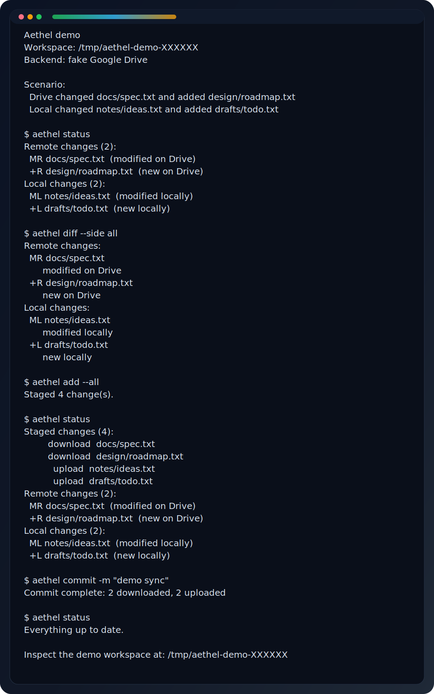

# Aethel

[](https://github.com/CCJ-0617/Aethel/actions/workflows/ci.yml)
[](https://www.npmjs.com/package/aethel)
[](LICENSE)
[](https://nodejs.org)

**Git-style Google Drive sync from your terminal.**

Aethel brings a `snapshot → diff → stage → commit` workflow to Google Drive. Track changes on both sides, resolve conflicts explicitly, and keep a full sync history — all without leaving the command line. It also ships with a dual-pane TUI for hands-on file management.

---

## Install

```bash
npm install -g aethel
```

<details>
<summary>Install from source</summary>

```bash
git clone https://github.com/CCJ-0617/Aethel.git
cd Aethel
npm install
npm run install:cli   # symlinks `aethel` into ~/.local/bin
```

</details>

**Requires Node.js >= 18**

## Setup

### 1. Get Google OAuth Credentials

1. Go to [Google Cloud Console](https://console.cloud.google.com/)
2. Create a project (or select an existing one)
3. Enable the **Google Drive API** (APIs & Services → Library)
4. Go to **APIs & Services → Credentials**
5. Click **Create Credentials → OAuth 2.0 Client ID**
6. Application type: **Desktop application**
7. Download the JSON file

### 2. Save Credentials

Save the downloaded JSON as `~/.config/aethel/credentials.json`:

```bash
mkdir -p ~/.config/aethel
mv ~/Downloads/client_secret_*.json ~/.config/aethel/credentials.json
```

You can also place `credentials.json` in the current directory, or pass a custom path with `--credentials`.

### 3. Authenticate

```bash
aethel auth                    # opens browser, saves token.json
```

### 4. Initialize a Workspace

```bash
aethel init --local-path ./my-drive     # sync entire My Drive
aethel init --local-path ./workspace --drive-folder <folder-id>  # sync specific folder
aethel pull --all -m "initial pull"     # hydrate local files from the current remote tree
```

> `credentials.json` and `token.json` are local secrets — never commit them.

## Demo

```bash
npm install
npm run demo
npm run demo:screenshot
```

Runs a fully local walkthrough against a fake Google Drive backend, so no OAuth setup is required.

The demo covers:

- remote modification: `docs/spec.txt`
- remote addition: `design/roadmap.txt`
- local modification: `notes/ideas.txt`
- local addition: `drafts/todo.txt`
- full sync flow: `status → diff → add --all → commit`

Useful commands:

```bash
npm run demo                               # run the transcript
node scripts/demo.js --redact-workspace    # stable output for docs or copy/paste
npm run demo:screenshot                    # regenerate docs/demo-screenshot.svg
```




### Usage

```bash
aethel status                  # local vs remote changes at a glance
aethel diff --side all         # detailed file-level diff
aethel add --all               # stage default suggested actions
aethel commit -m "sync"        # execute staged operations

aethel pull -m "pull"          # fetch remote changes and apply
aethel pull --all              # download the full remote tree to local
aethel push -m "push"          # push local changes to Drive
```

`pull` applies remote changes relative to the latest snapshot. Use `pull --all` for the first full download or to rehydrate a local workspace from the current remote tree.

### Conflict Resolution

When both local and remote change the same path:

```bash
aethel status                  # identify conflicts
aethel resolve <path> --keep local   # or: remote, both
aethel commit -m "resolve"
```

### Deduplication

Multi-device conflicts can leave duplicate folders on Drive:

```bash
aethel dedupe-folders            # dry run — report only
aethel dedupe-folders --execute  # merge duplicates, trash empties
```

Processes deepest-first for single-pass convergence, caches child state to minimize API calls, and runs independent merge groups in parallel.

## Commands

| Command            | Description                                                         |
| ------------------ | ------------------------------------------------------------------- |
| `auth`           | OAuth flow — creates `token.json`, verifies Drive access         |
| `init`           | Initialize a local sync workspace                                   |
| `status`         | Show local vs remote changes                                        |
| `diff`           | Detailed file differences                                           |
| `add`            | Stage changes                                                       |
| `reset`          | Unstage changes                                                     |
| `commit`         | Execute staged sync operations                                      |
| `pull`           | Fetch and apply remote changes (`--all` for full remote download) |
| `push`           | Push local changes to Drive                                         |
| `log`            | Sync history                                                        |
| `fetch`          | Refresh remote state without applying                               |
| `resolve`        | Resolve conflicts (local / remote / both)                           |
| `ignore`         | Manage `.aethelignore` patterns                                   |
| `show`           | Inspect a saved snapshot                                            |
| `restore`        | Restore files from the last snapshot                                |
| `rm`             | Remove local files and stage remote deletion                        |
| `mv`             | Move or rename local files                                          |
| `clean`          | List and optionally trash/delete Drive files                        |
| `dedupe-folders` | Detect and merge duplicate remote folders                           |
| `tui`            | Launch interactive terminal UI                                      |

## TUI

```bash
aethel tui
```

Dual-pane file browser — local filesystem on the left, Google Drive on the right.

| Key                  | Action                                             |
| -------------------- | -------------------------------------------------- |
| `Tab`              | Switch panes                                       |
| `Left` / `Right` | Navigate up / into directories                     |
| `u`                | Upload selected local file or folder to Drive      |
| `s`                | Batch sync local folder to current Drive directory |
| `U`                | Upload from a manually entered path                |
| `n`                | Rename selected local item                         |
| `x`                | Delete selected local item                         |
| `Space`            | Toggle selection in Drive pane                     |
| `t` / `d`        | Trash / permanently delete selected Drive items    |
| `/`                | Filter by name                                     |
| `f`                | Open the commands page and choose a TUI action     |
| `:`                | Run any Aethel CLI command inside the TUI          |

## Ignore Patterns

Create `.aethelignore` (gitignore syntax) in your workspace root — or run `aethel init` to generate a default one.

```gitignore
.venv/
node_modules/
__pycache__/
.idea/
dist/
build/
```

## Environment Variables

| Variable                          | Default                               | Description                       |
| --------------------------------- | ------------------------------------- | --------------------------------- |
| `GOOGLE_DRIVE_CREDENTIALS_PATH` | `~/.config/aethel/credentials.json` | Path to OAuth credentials         |
| `GOOGLE_DRIVE_TOKEN_PATH`       | `~/.config/aethel/token.json`       | Path to cached OAuth token        |
| `AETHEL_DRIVE_CONCURRENCY`      | `40`                                | Max concurrent Drive API requests |

## Architecture

Aethel uses a **Repository pattern** — a single `Repository` class (`src/core/repository.js`) wraps all core modules and serves as the unified data-access layer for both the CLI and the TUI.

```
src/
├── cli.js                    CLI entry — all handlers use Repository
├── core/
│   ├── repository.js         Unified data-access layer
│   ├── auth.js               OAuth authentication
│   ├── config.js             Workspace config & state persistence
│   ├── diff.js               Change detection between states
│   ├── drive-api.js          Google Drive API wrapper
│   ├── local-fs.js           Local filesystem operations
│   ├── remote-cache.js       Short-lived remote file cache
│   ├── snapshot.js            Local scanning & snapshot creation
│   ├── staging.js            Stage/unstage operations
│   ├── sync.js               Execute staged changes
│   └── ignore.js             .aethelignore pattern matching
└── tui/
    ├── app.js                React (Ink) dual-pane component
    ├── index.js              TUI entry
    ├── commands.js           CLI command parser for TUI
    └── command-catalog.js    Available TUI commands
```

See [docs/ARCHITECTURE.md](docs/ARCHITECTURE.md) for detailed module structure and data flow.

## Contributing

See [CONTRIBUTING.md](CONTRIBUTING.md) for development setup and guidelines.

## License

[MIT](LICENSE)
