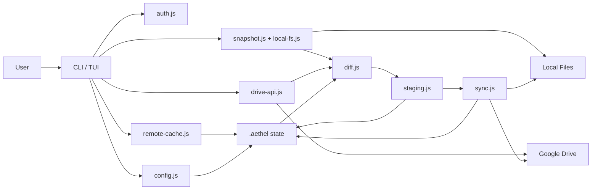

# Aethel Architecture

## 1. Project Positioning

Aethel is a synchronization tool that uses Google Drive as its remote storage. It exposes two interface layers:

- CLI: provides a Git-like workflow with `auth`, `init`, `status`, `diff`, `add`, `commit`, `pull`, and `push`.
- TUI: provides an interactive dual-pane interface for local files and Google Drive.

The core design is not a live mirror between local storage and Drive. Instead, synchronization is managed through a `snapshot + diff + staging + execute` pipeline.

## 2. Module Layers

### 2.1 Entry Layer

- `src/cli.js`
  - Command-line entry point
  - Parses commands, assembles workspace state, and invokes core sync capabilities
- `src/tui/index.js`
  - Starts the Ink TUI
- `src/tui/app.js`
  - Implements dual-pane file browsing, filtering, uploads, deletion, and interactive operations

### 2.2 Core Capability Layer

- `src/core/auth.js`
  - OAuth authentication
  - Creates and reads `token.json`
- `src/core/drive-api.js`
  - Google Drive API wrapper
  - Listing, downloading, uploading, deleting, folder creation, and batch operations
- `src/core/local-fs.js`
  - Local filesystem operations
- `src/core/snapshot.js`
  - Scans local files, computes md5 hashes, and builds snapshots
- `src/core/diff.js`
  - Compares snapshot / remote / local state and produces change sets
- `src/core/staging.js`
  - Manages the staging area
- `src/core/sync.js`
  - Executes staged operations
- `src/core/config.js`
  - Manages `.aethel/` state files
- `src/core/ignore.js`
  - Manages `.aethelignore`
- `src/core/remote-cache.js`
  - Short-lived cache for remote listings
- `src/core/compress.js`
  - Multi-algorithm compression (gzip, brotli, zstd, xz)
  - Compression profiles and algorithm detection
- `src/core/pack.js`
  - Tar archive creation and extraction
  - Tree hash algorithm for fast directory fingerprinting
- `src/core/pack-manifest.js`
  - CRUD operations for pack manifest
  - Tracks packed directories and their sync state

### 2.3 State Storage Layer

After workspace initialization, the project root contains:

```text
.aethel/
  config.json
  index.json
  .hash-cache.json
  pack-manifest.json
  snapshots/
    latest.json
    history/
.aethelconfig
```

- `config.json`: sync root configuration
- `index.json`: currently staged operations
- `.hash-cache.json`: local file hash cache
- `pack-manifest.json`: tracks packed directories and their sync state
- `snapshots/latest.json`: baseline state after the most recent successful sync
- `snapshots/history/`: archived older snapshots
- `.aethelconfig` (workspace root): YAML configuration for directory packing

## 3. Core Data Flow



## 4. Synchronization Model

### 4.1 Baseline

Aethel uses `snapshot` as the shared baseline:

- `snapshot.files`: remote file information from the last sync
- `snapshot.localFiles`: local file information from the last sync

That means the system does not compare only "local vs remote". It also asks:

- Has Drive changed since the last sync?
- Has local state changed since the last sync?
- Did both sides modify the same path?

### 4.2 Diff Categories

`src/core/diff.js` classifies changes as:

**File changes:**
- `remote_added`
- `remote_modified`
- `remote_deleted`
- `local_added`
- `local_modified`
- `local_deleted`
- `conflict`

**Pack changes (for packed directories):**
- `pack_new` - directory newly configured for packing
- `pack_local_modified` - packed directory changed locally
- `pack_remote_modified` - packed directory changed on Drive
- `pack_synced` - packed directory up to date
- `pack_conflict` - both sides changed the packed directory

It also provides default suggested actions for each category:

- Drive added/modified -> `download`
- Drive deleted -> `delete_local`
- Local added/modified -> `upload`
- Local deleted -> `delete_remote`
- Both sides changed the same path -> `conflict`
- Pack new/local modified -> `push_pack`
- Pack remote modified -> `pull_pack`
- Pack conflict -> `resolve_pack`

### 4.3 Execution Model

`commit` is not a Git commit. It executes the synchronization actions currently staged:

1. Read `index.json`
2. Route each entry by action as `download / upload / delete_local / delete_remote`
3. Execute local and remote operations
4. Clear staged entries
5. Rebuild the snapshot and write the new state to `.aethel/snapshots/latest.json`

## 5. Relationship Between TUI and CLI

Both interfaces share the same core modules. The difference is only the interaction surface:

- CLI is oriented toward predictable, scriptable sync workflows
- TUI is oriented toward manual inspection, fast operations, and hands-on Drive / Local management

The TUI is not a separate synchronization engine. It directly calls `drive-api.js` and `local-fs.js` for interactive file management.

## 6. Recommended Workflow

### 6.1 Initial Workspace Setup

```bash
npm install
npm run auth
node src/cli.js init --local-path ./workspace --drive-folder <drive-folder-id>
```

Use this when:

- Starting a new project
- Creating a new sync root
- Intentionally syncing only a specific Drive folder

### 6.2 Day-to-Day Sync Workflow

```bash
node src/cli.js status
node src/cli.js diff --side all
node src/cli.js add --all
node src/cli.js commit -m "sync"
```

This is the most reasonable standard flow because:

1. `status` gives you the overall state first
2. `diff` shows details and conflicts
3. `add --all` stages the default suggested actions
4. `commit` performs the actual synchronization

This preserves a manual confirmation point and helps avoid pushing a bad state to Drive or overwriting local files by mistake.

### 6.3 When Conflicts Occur

Recommended flow:

1. Run `status` or `diff`
2. Identify `conflict` entries
3. Decide explicitly whether to keep local, keep remote, or keep both
4. Then stage and commit

Why:

- In Aethel, a conflict means both sides changed the same path after the snapshot
- This should not be resolved automatically because it can cause silent overwrites

### 6.4 When Manual Inspection Is Needed

```bash
npm run tui
```

The TUI is useful for:

- Browsing the Drive structure
- Selecting items and deleting them
- Uploading files or entire folders directly from local storage
- Finding files quickly with filters

If the goal is traceable, repeatable synchronization, the CLI workflow should still be the default choice.

## 7. Recommended Practices

- Use a single Drive root folder as the workspace remote root instead of syncing the entire My Drive directly.
- Run `status` or `diff` before every `commit`.
- Treat `.aethelignore` as a synchronization boundary control file, not just a UI filter.
- Keep `.hash-cache.json` for large workspaces to avoid recomputing all md5 values every time.
- Prefer the TUI or a dry run for risky operations before executing them for real.

## 8. Future Improvements

- Split CLI commands and state transitions into a service layer to reduce how much workflow logic is aggregated in `src/cli.js`.
- Add documentation for the snapshot schema and index schema.
- Add automated tests, especially around diff/conflict handling and the sync executor.
